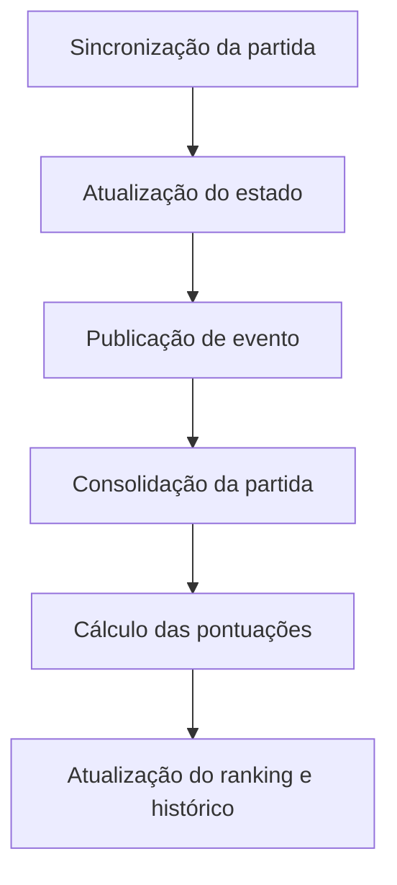

# Bolão Esportivo API

API REST para criar e administrar bolões de futebol. Cada grupo pode definir suas próprias regras de pontuação, critérios de desempate e período permitido para registrar palpites. O sistema também acompanha partidas, calcula pontuações e mantém rankings atuais e históricos.

O projeto foi desenvolvido na disciplina Projeto de Software, do curso de Ciência da Computação da UFCG. O trabalho teve como foco design de código, aplicação de padrões de projeto e modelagem de regras de negócio que variam conforme o contexto, mantendo o domínio organizado e coberto por testes automatizados.

## Funcionalidades

- Cadastro e gerenciamento de usuários.
- Perfis padrão, premium e administrador.
- Criação de grupos públicos ou privados, com limite de participantes.
- Entrada em grupos públicos e envio de convites para grupos privados.
- Configuração de regras de pontuação por grupo.
- Ordenação de critérios de desempate.
- Definição da janela de abertura e fechamento dos palpites.
- Registro, alteração e exclusão de palpites enquanto a janela estiver aberta.
- Sincronização de campeonatos, partidas e classificações com a Football-Data.org.
- Atualização automática do estado das partidas.
- Consolidação de partidas finalizadas e cálculo das pontuações.
- Rankings global e por grupo, com histórico de posições.
- Estatísticas de desempenho dos participantes.
- Recomendações de placar para usuários premium, calculadas a partir do histórico das equipes.
- Promoção automática de usuários para o perfil premium com base em critérios de uso e desempenho.

## Organização da aplicação

A aplicação segue uma estrutura em camadas, separando entrada HTTP, regras de negócio e persistência:

```text
controller  -> endpoints e validação das requisições
service     -> casos de uso e regras do domínio
repository  -> acesso aos dados com Spring Data JPA
model       -> entidades e objetos do domínio
dto         -> contratos de entrada e saída da API
event       -> eventos internos da aplicação
exception   -> tratamento centralizado de erros
```

Alguns fluxos foram separados por eventos do Spring. Depois que uma alteração é confirmada no banco, listeners cuidam de ações como consolidação de partidas, atualização de rankings, criação de registros históricos, cálculo de estatísticas e notificações. Dessa forma, esses processos não ficam diretamente acoplados ao serviço que alterou a partida.

O estado de uma partida é tratado com o padrão State, com comportamentos específicos para partidas abertas, em andamento, finalizadas ou canceladas. As recomendações de placar usam Strategy, permitindo escolher a abordagem de cálculo de acordo com os dados disponíveis.



## Tecnologias

- Java 17
- Spring Boot 3
- Spring Web
- Spring Data JPA
- Bean Validation
- H2 Database
- Springdoc OpenAPI
- JUnit 5 e Mockito
- JaCoCo
- Gradle
- Lombok
- ModelMapper

## Como executar

### Pré-requisitos

- JDK 17
- Git

O projeto utiliza o Gradle Wrapper, portanto não é necessário instalar o Gradle separadamente.

### Clonando o repositório

```bash
git clone https://github.com/isadoralucena/bolao-esportivo-api.git
cd bolao-esportivo-api
```

### Configurando a integração com dados de futebol

A aplicação pode ser iniciada sem uma chave externa e já possui dados locais para teste. Para sincronizar campeonatos e partidas com a Football-Data.org, defina a variável de ambiente `FOOTBALL_API_KEY`.

No Linux ou macOS:

```bash
export FOOTBALL_API_KEY=sua_chave
```

No PowerShell:

```powershell
$env:FOOTBALL_API_KEY="sua_chave"
```

### Iniciando a aplicação

No Linux ou macOS:

```bash
./gradlew bootRun
```

No Windows:

```powershell
.\gradlew.bat bootRun
```

A API será iniciada em `http://localhost:8080`.

## Documentação e banco local

Com a aplicação em execução, os seguintes endereços ficam disponíveis:

| Recurso | Endereço |
| --- | --- |
| Swagger UI | `http://localhost:8080/swagger-ui/index.html` |
| Especificação OpenAPI | `http://localhost:8080/v3/api-docs` |
| Console do H2 | `http://localhost:8080/h2-console` |

Configuração do banco local:

| Campo | Valor |
| --- | --- |
| JDBC URL | `jdbc:h2:mem:testdb` |
| Usuário | `admin` |
| Senha | `admin` |

O arquivo `import.sql` carrega usuários, campeonatos, grupos, partidas, palpites, pontuações e rankings de exemplo sempre que a aplicação é iniciada.

## Principais recursos da API

| Recurso | Responsabilidade |
| --- | --- |
| `/usuarios` | Cadastro, consulta e gerenciamento de usuários |
| `/campeonatos` | Campeonatos e sincronização de dados externos |
| `/grupos` | Grupos, participantes, regras e critérios de desempate |
| `/convites` | Convites para grupos privados |
| `/grupos/{grupoId}/partidas` | Partidas relacionadas ao grupo |
| `/grupos/{grupoId}/partidas/{partidaId}/palpites` | Criação e consulta de palpites |
| `/ranking` | Ranking global e ranking por grupo |
| `/grupos/{grupoId}/ranking/historico` | Evolução das posições no ranking |
| `/usuarios/{usuarioId}/estatisticas` | Estatísticas do participante |
| `/grupos/{grupoId}/partidas/{partidaId}/recomendacao` | Recomendação de placar para usuários premium |

Os parâmetros, corpos das requisições e respostas podem ser consultados diretamente no Swagger.

## Testes

Para executar a suíte de testes:

```bash
./gradlew test
```

Para executar os testes e gerar o relatório de cobertura:

```bash
./gradlew test jacocoTestReport
```

O relatório HTML será criado em:

```text
build/reports/jacoco/test/html/index.html
```
